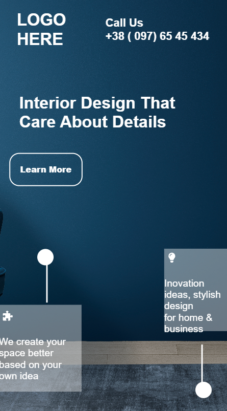

# project-10 #
[project-live](https://fswd-project10.netlify.app)
   - - - -
 # Technology used in this project #
    

   - - - - 
* Skill Gained in this project
  * Learned to make website responsive for multiple screen using __Media Queries__
  * Learn to used change direction of content in row or colum  and align item  using 
  __flex-direction__, __justifycontent__
  ,__align item__
  *  Leaned to  change the position using __realtive,absolute, etc__
   * Learned to target elements using __:nth- child ,:f to create button using irst-child, :last child__
  * Learned__padding__  and __border radius__
  * Learned to rotate  the line in this project using __transform:rotate__ 
  * Learned to fix the background image using property __background-repeat , background-position , background-size, background-attachment__
   - - - -
 ## Time taken to complete this project ##
 * 5 to 6 hrs  to completed this poject
 
 ## Destop view ##
 
  

 ## Moblie View
 
 
